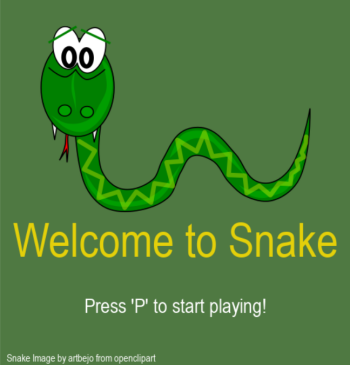
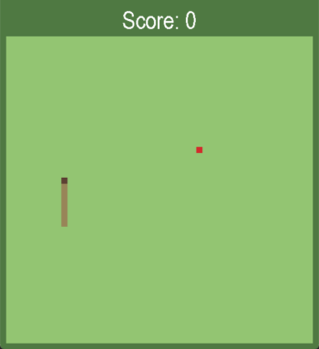
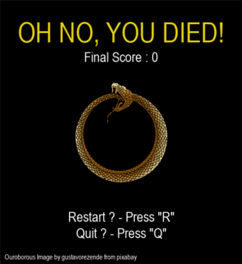

# Snake

Having grown up playing snake on a Nokia 3310
(a cultural and historical treasure if I might add), it was high time for me to pay homage to this classic game by
learning to implement it myself using python and its wonderful pygame library.

(image from *https://www.hmd.com/en_int/blog/snake-game-revisited-surprising-facts-and-fascinating-trivia*)

## How to use this repository

In order to use this repo, simply follow the below steps:
- Clone the repository on your computer
- Be sure to 'pip install pygame' in your virtual environment

## How to play the game

### Rules :

In this game you are in control of a ... well, a snake (shock).\
You start off as a small snake in the prime of its youth, with a body made up of four elements
(and the never-ending appetite of King Erysichthon).\
Your goal is to find and eat as many apples as you can in order to have the highest possible score.\
Each time you eat an apple your score goes up by 1, and your body becomes longer (by 1 element).\
However, be careful! Should you inadvertently hit a wall or worse, eat yourself, it will be game over!\
To add a little challenge to this enterprise, each time you eat an apple, you will go faster.\
So I ask of you, how well will you fare? Will you be praised and honoured by taking home the highest of scores?
Or will your life and aspiration be cut short by your own clumsiness? 
Will your snake's existence end as ouroboros eating its own tails, or will you be knocked out in shame by your own 
clumsiness?

### Controls :

- Whilst on the *start screen*, press 'P' to start the game.

- During the game, use the directional arrows on your keyboard to move the snake:
  - &uarr; : up
  - &darr; : down
  - &rarr; : right
  - &larr; : left

  If you are going up, you cannot go down. You have to first go right or left. And vice versa. The same applies if you
are going left/right. You cannot go in the opposite direction straight away and need to go 'around'.

- Whilst on the *game over* screen, press 'R' to restart the game. Alternatively, press 'Q' to quit.

